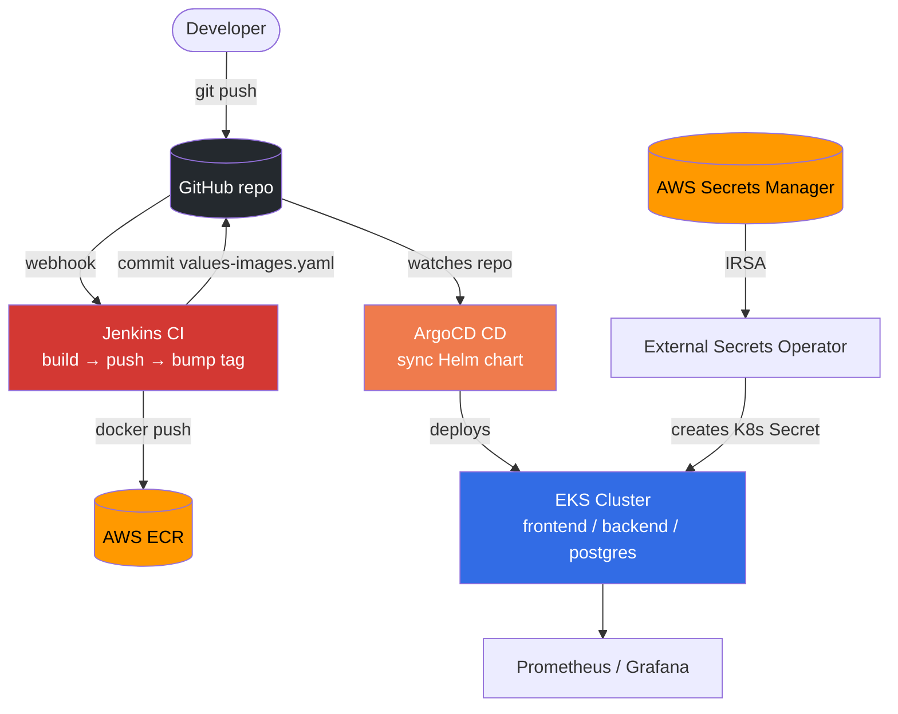
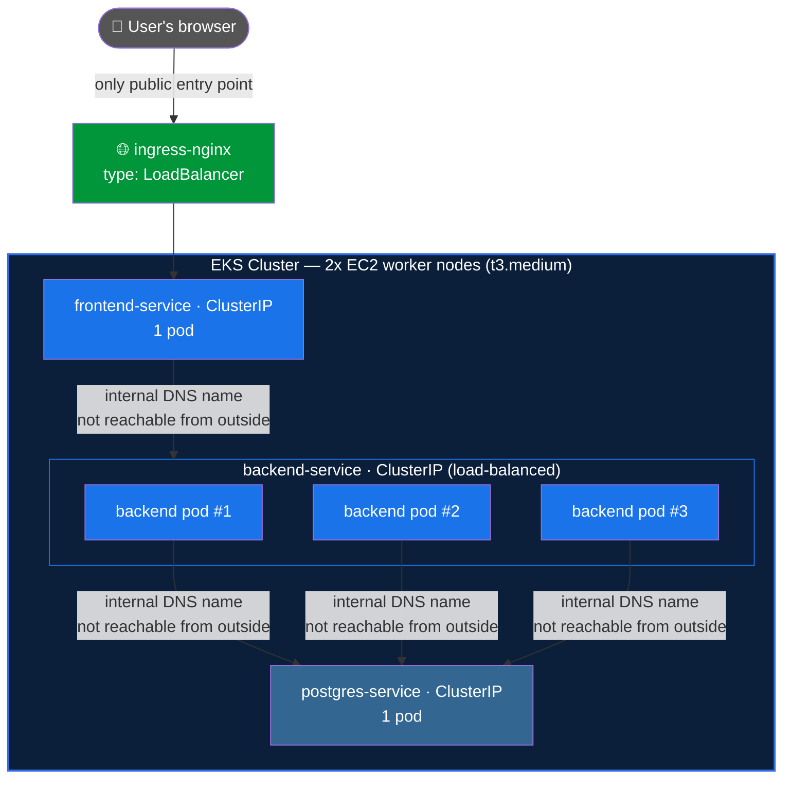

# DevOps Task Manager — High Level Design

## Architecture



## Inside the Cluster

Two EC2 instances back the EKS cluster as worker nodes (`t3.medium`, auto-scaling group sized 1-3, desired 2). Jenkins runs on a separate, third EC2 instance entirely outside the cluster - it never gets `kubectl`/cluster access at all (see Security).



**Why this is locked down, not just "it works":** every Service in the chart (`frontend-service`, `backend-service`, `postgres-service`) is `type: ClusterIP` - reachable only from inside the cluster's own network, with no direct pod IP, no NodePort, and no public IP of any kind. `ingress-nginx` is the *only* Service of type `LoadBalancer`, meaning it's the only thing with a public AWS ELB in front of it. A user (or an attacker) outside the cluster has no path to the backend or the database directly - every request must go through the ingress, which only forwards to `frontend-service`. The frontend then calls the backend over the internal ClusterIP, and only the backend can reach Postgres - the database is never one hop away from the internet.

**Pod counts and why:** backend runs 3 replicas (stateless, so scaling it is free and gives some redundancy); frontend runs 1 (a static/lightweight proxy layer, no state, low value in replicating for a portfolio-scale app); Postgres runs 1 (see Known Limitations - a single stateful pod, not HA). These aren't fixed forever - `backend.replicaCount` etc. in `values.yaml` are just numbers ArgoCD applies on every sync.

## Key Flows

**CI (Jenkins):** push → build image → push to ECR → bump image tag in `values-images.yaml` → commit + push.

**CD (ArgoCD):** watches the repo → merges `values.yaml` + `values-images.yaml` → syncs the Helm chart → Kubernetes rolls out the new pods.

**Secrets (External Secrets Operator):** reads `app-secrets` from AWS Secrets Manager via IRSA → creates/refreshes the `app-secret` K8s Secret → backend/postgres pods read it normally.

## Components

| Component | Tool | Responsibility |
|---|---|---|
| Infra + cluster add-ons | Terraform | VPC/EKS/EC2/ECR + ingress-nginx, kube-prometheus-stack, argocd, external-secrets |
| CI | Jenkins | Build, tag, push image, bump the GitOps tag file |
| CD | ArgoCD | Applies the Helm chart, self-heals drift, prunes removed resources |
| Secrets sync | External Secrets Operator | Syncs `app-secrets` from AWS Secrets Manager into a K8s Secret |
| App packaging | Helm chart (`gitops/task-manager`) | backend + frontend + postgres + configmap + secret/externalsecret + pvc + ingress |
| Ingress | ingress-nginx | Routes external traffic to the frontend |
| Monitoring | kube-prometheus-stack | Prometheus + Grafana + Alertmanager |

## Security

- Jenkins: IAM instance profile scoped to ECR push only - no static AWS keys, no cluster access.
- External Secrets Operator: IRSA, read-only to `app-secrets` only.
- Grafana + ArgoCD: ClusterIP only, reachable via `kubectl port-forward`.
- Jenkins itself: authenticated (single admin account), not left open on the setup wizard's default of no login.
- CI: Trivy scans both images for HIGH/CRITICAL CVEs and fails the build before anything reaches ECR - installed on the Jenkins EC2 pinned to a fixed, checksum-verified version, not a floating "latest" tag (Trivy's own release pipeline was compromised twice in 2026 via poisoned releases/tags).

## Cleanup Order

1. Delete the ArgoCD Application (cascades, releases its Load Balancer + PVC)
2. Uninstall ingress-nginx, wait for its Load Balancer to release
3. `terraform destroy`
4. `verify_cleanup()` checks AWS directly for anything left over

See `destroy.sh` for the full script.

## Known Limitations

| Limitation | Mitigation |
|---|---|
| Postgres is a single pod, no HA | RDS is the natural next step |
| ECR repo names don't match `project_name` | Intentional - repos already hold image history |

## Jenkins Bootstrap

`aws_instance.jenkins`'s `user_data` (see `terraform/templates/`) installs Jenkins/Docker/AWS CLI on first boot, then drops a Groovy script into `init.groovy.d/` that runs as Jenkins starts:
1. Creates a single admin account (skips the setup wizard, which would otherwise leave Jenkins with no login)
2. Creates the `github-credentials` credential from `github_pat`
3. Creates the `task-manager` Pipeline job (SCM = this repo, Script Path = `Jenkinsfile`, GitHub push trigger)

`create.sh` then points the GitHub webhook at the new EC2's IP (re-pointing it every run, since the IP changes each time).

## Deployment

```bash
cp .env.example .env   # fill in real values - see comments in that file
./create.sh             # bring everything up
./destroy.sh            # tear everything down
```
