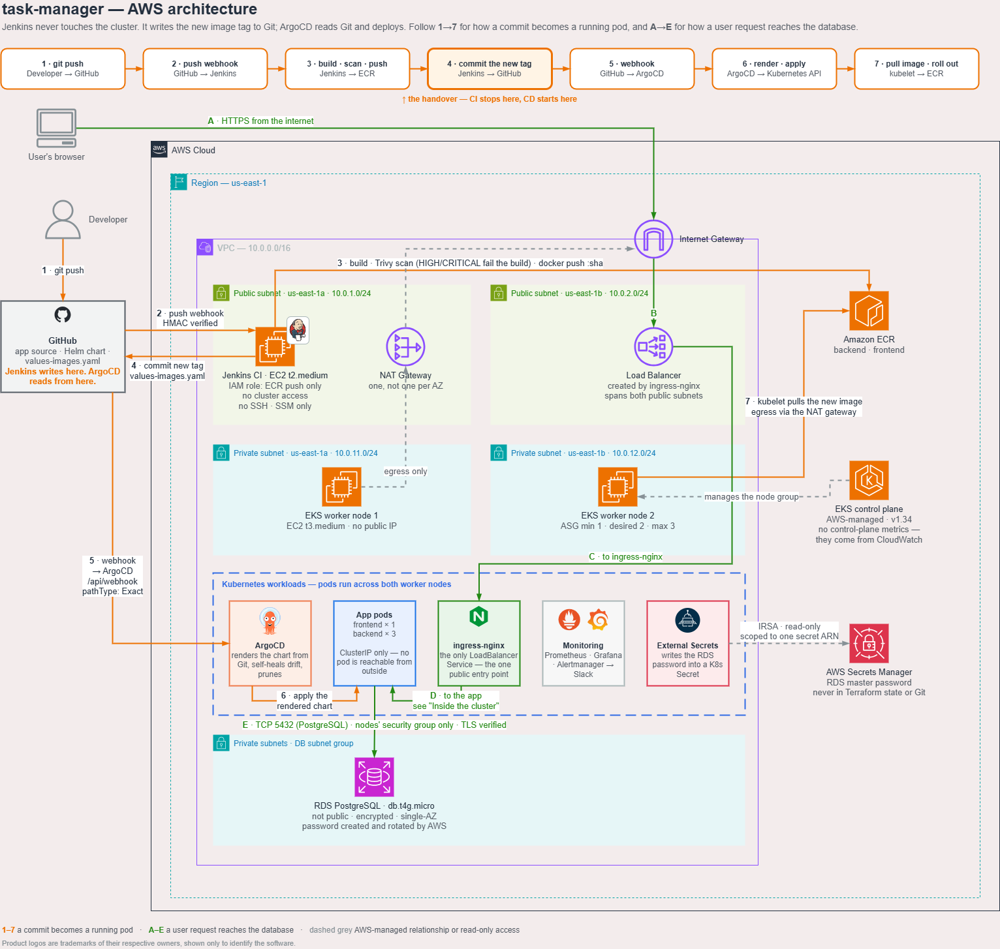
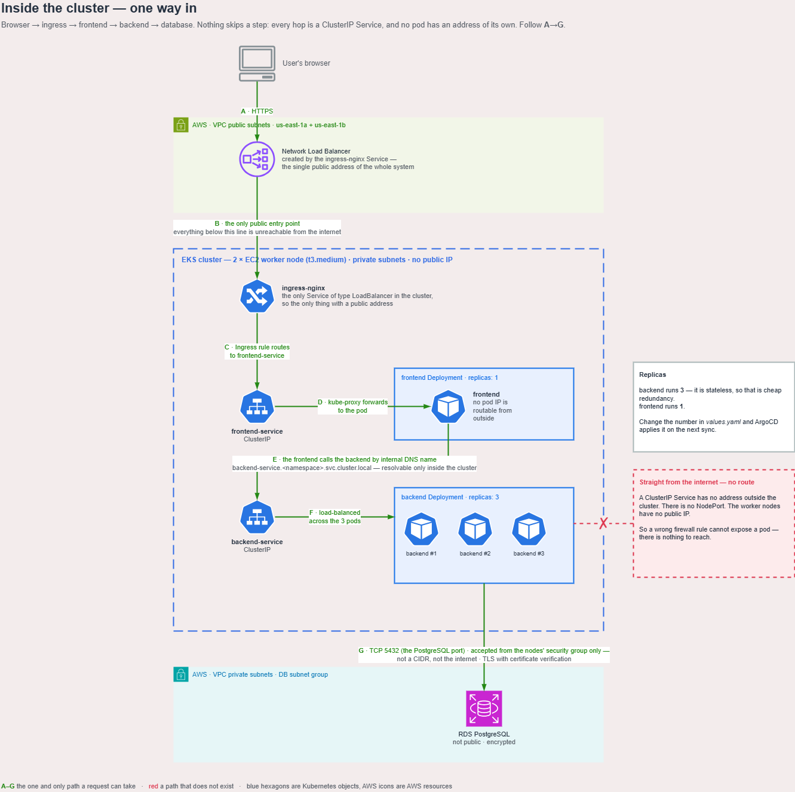

# High Level Design

## The idea in one line

**Jenkins cannot touch the cluster.** It writes the new image tag to Git. ArgoCD reads Git and deploys.

That split is why a compromised CI server can't reach production, and why `git revert` is a rollback.

---

## Architecture



---

## Inside the cluster

Three EC2 instances:

| | Where | Why |
|---|---|---|
| **2 × worker nodes** | Private subnets, no public IP | Run the app. ASG 1–3, desired 2 |
| **1 × Jenkins** | Public subnet | Needs a public IP for GitHub webhooks. No cluster access |

The nodes need internet access to pull images. That goes out through one NAT gateway. ECR image layers skip it: they come from S3, through a free S3 gateway endpoint.



### One way in

Browser → ingress → frontend → backend → database. Nothing skips a step.

- Both app Services are `ClusterIP`. No pod IP, no NodePort, no public IP
- `ingress-nginx` is the only `LoadBalancer`, so it's the only public entry point
- The ingress routes to the frontend only. The backend API is never exposed — the frontend forwards a fixed list of routes to it
- Worker nodes have no public IP, so a bad firewall rule can't expose them
- RDS accepts port 5432 from the nodes' security group only — not a CIDR, not the internet

**Replicas:** backend runs 3 (stateless, so it's cheap redundancy), frontend runs 1. Change the number in `values.yaml` and ArgoCD applies it on the next sync.

---

## The application

| | Tool | Job |
|---|---|---|
| **Frontend** | Next.js | Pages, plus a thin server layer (a *BFF*) that holds the session cookies and forwards API calls |
| **Backend** | NestJS | The API: accounts, sessions, tasks. Every route requires a valid access token unless marked public |
| **Database** | PostgreSQL | Schema managed by migrations the backend runs on startup |

### Sessions

1. The user signs up or signs in with a username and password. The backend checks the password against its **argon2id** hash
2. The backend issues an **access token** (a JWT, 15 minutes) and a **refresh token** (random, 7 days, stored only as a hash)
3. The frontend's server puts both in `httpOnly` cookies. Page JavaScript never sees a token, so an XSS bug cannot steal one
4. Every API call goes through the frontend, which adds the access token. When it expires, the frontend refreshes the pair
5. **A refresh token works once.** Presenting a rotated token again after a 30-second grace window counts as theft, and every session of that account ends

<details>
<summary>The other protections on the sign-in path</summary>

<br>

**Same answer for a wrong password and an unknown user** — same message, same hashing time. Neither reveals which usernames exist.

**Rate limits.** 20 attempts a minute per client on the sign-in, sign-up and refresh routes; 300 a minute elsewhere.

**Cross-site requests are rejected.** Cookies are `SameSite=Lax`, and every state-changing request must carry an `Origin` equal to `APP_URL`.

**Migrations cannot collide.** Three backend replicas start together; a Postgres advisory lock lets exactly one apply pending migrations while the others wait.

</details>

### Google sign-in

Google only returns users to an **HTTPS** address on a **fixed domain**. The domain is an input to the infrastructure, and TLS terminates on the load balancer with an ACM certificate, so the only thing left is the credential itself.

That credential belongs to a Google project, not to this infrastructure, so Terraform never holds it. It sits in the Secrets Manager entry maintained by hand, and Terraform only passes that entry's name to the chart:

| Step | Why |
|---|---|
| `https://<domain>/api/auth/callback` registered on the Google OAuth client | Google only returns users to registered addresses |
| `GOOGLE_CLIENT_ID` / `GOOGLE_CLIENT_SECRET` in the credentials entry | The value reaches AWS without passing through Terraform, Git, or a local file |
| External Secrets syncs both into the cluster | Same path as every other secret |

`terraform output google_redirect_uri` and `credentials_secret` print what is needed. Leave the keys out and the backend refuses every Google token and the login page hides the button, while username + password sign-in works as usual.

---

## Key flows

**CI** — push → build → Trivy scan → push to ECR under the commit's own tag → bump the tag file → commit

**CD** — webhook → merge the values files → sync the chart → Kubernetes rolls out

**Secrets** — External Secrets Operator reads two secrets from Secrets Manager over IRSA and writes them into one K8s Secret: the RDS password, which AWS rotates itself and which never enters Terraform state or Git, and the JWT signing key, which Terraform generates.

<details>
<summary>Why ArgoCD ignores most commits — and reverts changes you never committed</summary>

<br>

ArgoCD compares **state**, not files. It renders the chart under `path: gitops/task-manager` and diffs the result against the live cluster.

Two consequences:

- A commit touching only `terraform/` or `app/` renders identical manifests. Nothing happens.
- A `kubectl edit` against the cluster matches no commit at all. `selfHeal` reverts it.

It acts on the difference, not on a file changing.

</details>

<details>
<summary>Why images are tagged with the commit, not a build number</summary>

<br>

A tag is `1a2b3c4`, the short hash of the commit it was built from. A build counter cannot
work here: `terraform destroy` takes Jenkins and its history with it, so the next cycle
starts at 1 and hands out tags that already mean a different commit. That is what broke the
first build after a rebuild.

Unique tags let the repositories be `IMMUTABLE`. A tag can never be repointed, so a running
image is provably the one Trivy scanned. `latest` and `v1` go with them — nothing consumed
them, and a moving tag cannot exist in such a repository.

Building the same commit twice is then a no-op rather than a failure: the pipeline reuses the
image ECR already has, and leaves the tag file alone when it already names that commit.

</details>

<details>
<summary>How deployment-specific values reach the chart without being committed</summary>

<br>

Several values can't live in Git: the RDS endpoint, the names of the RDS master secret, the JWT secret and the Google credential, the two ECR registry URLs, and the app's own address. They embed account-specific data or are generated during the apply.

Terraform creates the ArgoCD `Application` itself, from the `argocd-apps` chart in a release of its own, and passes all of them in as Helm parameters. They are ordinary Terraform references, so a mistake is a plan-time error rather than something that surfaces as a broken app.

The app's address is the awkward one: the frontend needs it as `APP_URL` to reject cross-site requests, and without a domain it would be the load balancer's generated DNS name, known only after the cluster is up and different on every rebuild. With a domain it is decided before anything is built, and the load balancer's hostname is only what the ALIAS record points at.

The chart refuses to render if any of them is missing, so a gap is a clear sync error rather than a broken app. Nothing in it is account-specific, so another account needs no edit to it.

</details>

---

## Components

| Component | Tool | Job |
|---|---|---|
| Infra + add-ons | Terraform | VPC, EKS, EC2, ECR, RDS, and the four cluster add-ons |
| CI | Jenkins | Build, scan, push, bump the tag file |
| CD | ArgoCD | Apply the chart, self-heal drift, prune |
| App | Next.js + NestJS | Frontend with a session layer, and the API behind it |
| Database | RDS Postgres | Private, SG-restricted, AWS-managed password |
| Secrets | External Secrets Operator | Secrets Manager → K8s Secret |
| Packaging | Helm chart | Deployments, Services, ConfigMap, Secret, Ingress |
| Ingress | ingress-nginx | The single public entry point |
| Monitoring | kube-prometheus-stack | Prometheus, Grafana, Alertmanager |

---

## Alerting

`warning` and `critical` alerts go to Slack. The URL is never a Terraform input: External Secrets reads `SLACK_WEBHOOK_URL` out of the hand-maintained credentials entry, copies it into the monitoring namespace, and Alertmanager reads it from a mounted file (`api_url_file`) - so it reaches neither the state file nor a rendered Helm value. Without that key, alerts still reach Alertmanager's own UI.

`critical` alerts also go to email, through the SNS topic the CloudWatch alarms and the budget already use. Alertmanager publishes with an IRSA role, not a key. One channel is one point of failure: a revoked webhook or a muted channel is indistinguishable from quiet.

**And who watches the alerting?** Alertmanager sends `Watchdog` - the alert that always fires - to a second SNS topic every five minutes, and nothing subscribes to it: the point is the publish, which CloudWatch counts. An alarm on that count fires when the heartbeat stops for fifteen minutes, so Prometheus, Alertmanager, the cluster or the nodes' route to AWS going down raises an email instead of silence. The alarm is ordered after the monitoring release, so a planned destroy takes it away before the heartbeat stops.

Two things are silenced on purpose:

| Silenced | Why |
|---|---|
| `InfoInhibitor` | Internal plumbing, never actionable |
| scheduler / controller-manager / etcd | EKS runs these on AWS's side and doesn't expose them |

**An alert that always fires is worse than no alert.** It teaches you to ignore the channel.

`kube-proxy` stays enabled — it genuinely runs here.

---

## Security

**Network**

| | |
|---|---|
| Worker nodes | Private subnets, no public IP. Egress via NAT, except in-region S3 (gateway endpoint) |
| App | HTTPS only - the load balancer terminates TLS, and nginx redirects port 80. The backend is `ClusterIP` only |
| Jenkins :8080 | Your IP + GitHub's webhook ranges. Nothing else |
| Jenkins SSH | **None.** Access is through SSM Session Manager |
| Grafana | ClusterIP. `port-forward` only |
| ArgoCD | ClusterIP, with one path exposed: `/api/webhook`, `pathType: Exact` |

**Identity**

| | |
|---|---|
| Jenkins | IAM instance profile, ECR push only. No static keys, no cluster access |
| External Secrets | IRSA, read-only, scoped to exactly two secret ARNs |
| RDS | Not public, encrypted, password created and rotated by AWS |
| App users | argon2id password hashes, rotating refresh tokens, `httpOnly` cookies |

**Both webhooks verify GitHub's HMAC signature.** Reaching the port isn't enough to trigger anything — so the firewall rules above are a second layer, not the only one.

<details>
<summary>Supply chain and runtime hardening</summary>

<br>

**Trivy gates the build.** HIGH and CRITICAL CVEs fail it before anything reaches ECR.

Trivy itself is pinned to a fixed version rather than pulled from a floating `latest`, and its tarball is checked against the published SHA-256 before it is installed. The bootstrap runs under `set -eo pipefail`, so a mismatch aborts it instead of leaving the build to scan with an unverified binary.

**Runtime images** run a current Node LTS with `npm` removed from the final stage. npm's bundled dependencies were the last HIGH findings standing between the image and a clean scan. The compiled code is owned by root, so the process cannot modify it.

**Database connections use TLS with certificate verification** against the Amazon RDS CA bundle baked into the image. Not `rejectUnauthorized: false`, which encrypts without authenticating.

**Jenkins' apt key is pinned and its key id verified** before the repo is trusted. A key rotation fails the bootstrap loudly instead of silently installing from an unsigned source.

</details>

---

## Teardown

```bash
terraform destroy
```

The dependency graph orders the network half: the Helm releases go first, then
the node group (~5 min), then the cluster (~10 min), and only then the subnets
and the VPC. By the time anything touches the network, the load balancer
Kubernetes created has been gone for a quarter of an hour, so no wait or retry
belongs between them. A destroy run on 2026-09-22 confirmed it: 97 resources, no
DependencyViolation.

**Why the monitoring volumes used to be left behind.** The nodes reach the AWS
API through the NAT, and nothing referenced the route to it, so Terraform deleted
it in the first second of a destroy. The EBS CSI driver's calls then timed out
before reaching AWS - which is why CloudTrail showed none - so no volume could be
detached, and Kubernetes does not delete an attached volume. The first row below
is the fix. To check after a destroy:

```bash
aws ec2 describe-volumes --filters Name=status,Values=available Name=tag:Project,Values=task-manager
```

What is arranged:

| | |
|---|---|
| The node group **depends on the NAT route** and on the private subnets' route-table links; the NAT, on its own subnet's link | Nothing else references them, so without this Terraform deletes them in the first second of a destroy, and everything still running on the nodes loses its way to the AWS API |
| The ArgoCD `Application` carries **no finalizer** | Helm deletes the Application and the ArgoCD controller in the same uninstall. A finalizer would wait for a controller that is already going, and hang until the timeout. Nothing is lost by dropping it: the app owns only ClusterIP Services, Deployments and an Ingress - no cloud resources |
| The `monitoring` namespace is a **Terraform resource**, not `create_namespace` | A Helm uninstall does not delete a namespace, and the Prometheus, Grafana and Alertmanager PVCs live in it. Deleting the namespace deletes the PVCs |
| Between that namespace and the EBS CSI driver, the destroy **waits until the volumes are gone** | A PersistentVolume is cluster-scoped and outlives its namespace, and the CSI driver removes the volume asynchronously afterwards. The destroy waits for each of the cluster's volumes to be deleted, up to 10 minutes; if one is not, it stops there - with the driver still running - instead of leaving it behind |
| The CSI addon **depends on its policy attachment**, not only its role | Otherwise nothing references the attachment and Terraform removes it in the first second of a destroy, leaving the driver without permission for the rest of it |
| The vpc-cni addon has `preserve = true` | Nothing orders it after the CSI chain; preserved, `aws-node` goes with the cluster at the very end instead of mid-teardown |

To confirm nothing was left behind:

```bash
aws resourcegroupstaggingapi get-resources --tag-filters Key=Project,Values=task-manager
```

Every resource carries that tag, including the two Kubernetes creates: the load
balancer is tagged through a Service annotation, and the EBS volumes through
the StorageClass. An empty result means the account is clean. It finds only
tagged resources, so it is a net rather than a proof.

---

## Design notes

Decisions that are not obvious from reading the code, and that something depends on.

| Decision | Why |
|---|---|
| ingress-nginx service: `targetPorts.https = http` | TLS terminates on the load balancer, so the controller receives plain HTTP on both ports. Without this it expects a second TLS handshake on 443 and every request fails |
| ingress-nginx config: `use-forwarded-headers` | With TLS terminated upstream, `X-Forwarded-Proto` is the only way nginx can tell HTTP from HTTPS - and the only way a redirect-to-HTTPS rule avoids looping |
| The Prometheus Operator CRDs are a release of their own, installed first | ingress-nginx and External Secrets ship ServiceMonitors, and they install before kube-prometheus-stack - which needs External Secrets for its own secrets. Letting the stack install the CRDs is a cycle; a separate CRD release breaks it. The stack runs with `crds.enabled = false` |
| The Helm releases are chained with `depends_on` | The provider shares one repository cache across resources; installing them in parallel makes all but one fail with "no cached repo found" on a cold cache. external-secrets also has to precede monitoring, whose release ships an ExternalSecret |
| The ArgoCD Application comes from the `argocd-apps` chart, in a release ordered after argo-cd | A chart cannot create a custom resource whose CRD it installs in that same release: Helm validates the whole manifest against the cluster before installing anything, so the kind does not exist yet. A `kubernetes_manifest` does not work either - it is evaluated at plan time, before the cluster exists |
| Kubernetes/Helm providers authenticate through `aws eks get-token`, not `aws_eks_cluster_auth` | That data source resolves once per plan and is stored in state, so the next run configures the provider with a token minted hours earlier. EKS tokens live 15 minutes |
| The SNS topics carry no KMS key | The AWS managed key for SNS grants use to IAM principals only - CloudWatch and Budgets cannot publish through it, and their notifications would fail silently. A customer managed key would cost a dollar a month and linger for a week after every destroy. The messages carry alarm names, not data |
| No SSH rule on the Jenkins security group | The instance is reached through SSM Session Manager, which needs no inbound port. Port 22 open on a host holding the GitHub token and ECR push rights was the largest hole here |
| `aws_route53_record.cert_validation` sets `allow_overwrite` | A stale validation record from a previous certificate in the same zone would otherwise block the apply |
| Grafana's admin login comes from an ExternalSecret, not a Helm value | A Helm value is an argument of the release resource and would be recorded in state, undoing the write-only argument that generated it |

---

## Known limitations

| Limitation | Trade-off |
|---|---|
| Two webhook signing secrets are in Terraform state | Unavoidable: Terraform hands the same value to GitHub and to the receiver, and an ephemeral value cannot reach an ordinary resource argument. Everything else it generates is written with a write-only argument and never recorded — see [State](#state) |
| The domain must already be a delegated Route53 zone | Terraform looks the zone up rather than creating it; a zone created in the same apply would not be delegated, and certificate validation would wait on DNS nobody can answer |
| A rebuild changes the Jenkins IP | The DNS record follows it, so the webhook keeps working, but the record's 60s TTL means a minute of stale answers |
| RDS is single-AZ | `multi_az = true` when uptime beats cost |
| One NAT gateway, not one per AZ | ~$32/month instead of ~$64. An AZ outage takes egress for both |
| S3 gateway endpoint only, no interface endpoints | ECR API, STS, Secrets Manager and EC2 calls still use the NAT. Interface endpoints cost ~$7/month each per AZ, more than the NAT |
| Helm add-ons install serially | Required — the provider shares one repo cache and concurrent installs fail |
| No control-plane metrics | EKS doesn't expose them. They come from CloudWatch instead |
| ECR repository names are fixed strings, not derived from `project_name` | The Jenkinsfile names the same repositories, and nothing passes the Terraform value to it. Renaming the project means editing both |

---

## Jenkins bootstrap

`user_data` installs Jenkins, Docker and the AWS CLI on first boot. A Groovy script then runs as Jenkins starts and creates:

1. The admin account *(skipping the setup wizard, which would leave Jenkins with no login)*
2. The `github-credentials` credential
3. The `task-manager` pipeline job, wired to this repo

The same Groovy script queues that job's first build — ECR is empty after every rebuild, and without one the pods would wait for the next push.

The three secrets it needs (its admin password, the webhook signing secret, and the GitHub token) are **not** rendered into `user_data`. Anything written there can be read back by every process on the instance through the metadata service, and is shown in plain text in the EC2 console. `user_data` carries only their Secrets Manager identifiers and fetches the values at boot with the instance's own IAM role, into files readable by the `jenkins` user alone.

Both webhooks are Terraform resources (`terraform/github.tf`) pointing at DNS names, so replacing the instance does not invalidate them.

---

## Deployment

```bash
cd terraform && terraform init && terraform apply   # up
terraform destroy                                   # down
```

One `terraform apply` builds everything, including DNS, the certificate, both GitHub webhooks and the first CI build. The app is live about ten minutes after it finishes, once that build has pushed images and ArgoCD has synced them.

There is no configuration file and no environment to set up. Three Secrets Manager entries - created once per account, outside the stack's lifecycle - carry the domain, the repository, the GitHub token and the Slack/Google credentials. Terraform reads the configuration ordinarily, reads the token through an `ephemeral` resource that it is not permitted to persist, and never reads the cluster's credentials at all: those go straight from AWS to the External Secrets operator. Nothing secret exists on the machine running the apply, which is also why `terraform destroy` needs no inputs.

### State

The state is the only record of what exists in the account, and it contains secrets, so it lives in S3 rather than next to the code: KMS-encrypted with a customer-managed key, versioned so a corrupted state is a restore rather than a rebuild, locked (S3 conditional writes - no DynamoDB table needed since Terraform 1.10) so two applies cannot overwrite each other, and with a bucket policy refusing anything that is not TLS. `terraform/bootstrap/` creates it; that configuration is the one place a local state file is acceptable, because it holds a bucket and a key and nothing else.

Secrets fall into three groups:

| | Where the value lives | How |
|---|---|---|
| RDS password | AWS only | `manage_master_user_password` - AWS creates and rotates it; Terraform never sees it |
| JWT key, Jenkins + Grafana admin | AWS only | Generated by an `ephemeral` resource and written with `secret_string_wo`, a write-only argument: sent to AWS, never recorded |
| Two webhook signing secrets | State (encrypted) | Terraform must hand the *same* value to GitHub and to the receiver, and both are ordinary resource arguments, which an ephemeral value may not reach |

Rotation of the second group is a single counter, `generated_secret_version`; incrementing it rewrites all three with fresh values.
