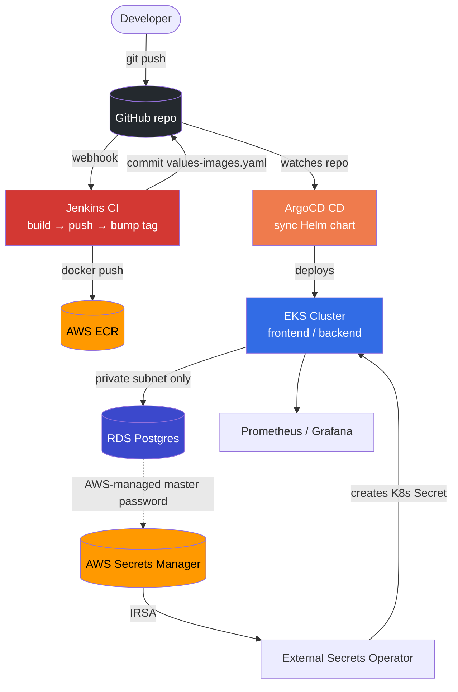
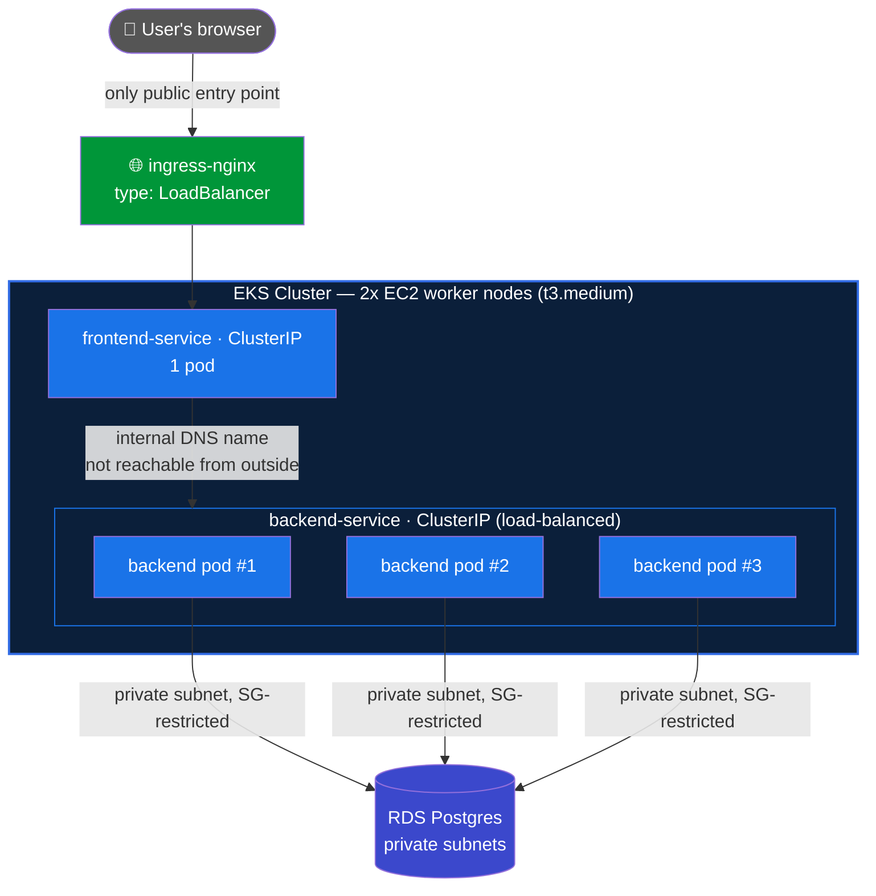

# DevOps Task Manager — High Level Design

## Architecture



## Inside the Cluster

Two EC2 instances back the EKS cluster as worker nodes (`t3.medium`, auto-scaling group sized 1-3, desired 2). Jenkins runs on a separate, third EC2 instance entirely outside the cluster - it never gets `kubectl`/cluster access at all (see Security).



**Why this is locked down, not just "it works":** both app Services (`frontend-service`, `backend-service`) are `type: ClusterIP` - reachable only from inside the cluster's own network, with no direct pod IP, no NodePort, and no public IP. `ingress-nginx` is the *only* Service of type `LoadBalancer`, so it's the only thing with a public AWS ELB in front of it. RDS sits in private subnets with `publicly_accessible = false`, and its security group accepts port 5432 from the EKS nodes' security group only - not from a CIDR range, and not from the internet at all. Every request must enter through the ingress, which only forwards to `frontend-service`; the frontend calls the backend internally, and only the backend can reach the database.

**Replica counts and why:** backend runs 3 replicas (stateless, so scaling it is free and gives some redundancy); frontend runs 1 (a lightweight proxy layer, no state). These aren't fixed forever - `backend.replicaCount` etc. in `values.yaml` are just numbers ArgoCD applies on every sync.

## Key Flows

**CI (Jenkins):** push → build image → push to ECR → bump image tag in `values-images.yaml` → commit + push.

**CD (ArgoCD):** watches the repo → merges `values.yaml` + `values-images.yaml` → syncs the Helm chart → Kubernetes rolls out the new pods.

**Secrets (External Secrets Operator):** reads the RDS master secret - which AWS generates and rotates itself, so the password never enters Terraform state or git - from Secrets Manager via IRSA → creates/refreshes the `app-secret` K8s Secret → backend pods read it as `DB_USER`/`DB_PASSWORD`.

**Wiring the dynamic values:** the RDS endpoint and the name AWS gives its master secret only exist after `terraform apply` and change on every run, so they can't be committed to git. `create.sh` reads them from `terraform output` and injects them into the ArgoCD Application as helm parameters, which keeps the chart itself fully generic.

## Components

| Component | Tool | Responsibility |
|---|---|---|
| Infra + cluster add-ons | Terraform | VPC/EKS/EC2/ECR/RDS + ingress-nginx, kube-prometheus-stack, argocd, external-secrets, EBS CSI driver |
| CI | Jenkins | Build, scan (Trivy), push image, bump the GitOps tag file |
| CD | ArgoCD | Applies the Helm chart, self-heals drift, prunes removed resources |
| Database | RDS Postgres | Private subnets, SG-restricted to the EKS nodes, AWS-managed master password |
| Secrets sync | External Secrets Operator | Syncs the RDS master secret from AWS Secrets Manager into a K8s Secret |
| App packaging | Helm chart (`gitops/task-manager`) | backend + frontend + configmap + secret/externalsecret + ingress |
| Ingress | ingress-nginx | Routes external traffic to the frontend |
| Monitoring | kube-prometheus-stack | Prometheus + Grafana + Alertmanager, on persistent volumes |

## Security

- Jenkins: IAM instance profile scoped to ECR push only - no static AWS keys, no cluster access.
- External Secrets Operator: IRSA, read-only, scoped to the RDS master secret's exact ARN.
- RDS: private subnets, `publicly_accessible = false`, storage encrypted, port 5432 open only to the EKS nodes' security group. Master password generated and rotated by AWS - never in Terraform state.
- Grafana + ArgoCD: ClusterIP only, reachable via `kubectl port-forward`.
- Jenkins itself: authenticated (single admin account), not left open on the setup wizard's default of no login.
- CI: Trivy scans both images for HIGH/CRITICAL CVEs and fails the build before anything reaches ECR - installed on the Jenkins EC2 pinned to a fixed, checksum-verified version, not a floating "latest" tag (Trivy's own release pipeline was compromised twice in 2026 via poisoned releases/tags).

## Cleanup Order

1. Delete the ArgoCD Application (cascades, releases everything it deployed)
2. Uninstall ingress-nginx, wait for its Load Balancer to release
3. Delete the monitoring PVCs - Prometheus/Alertmanager volumes come from StatefulSet templates, which neither `helm uninstall` nor `terraform destroy` removes, so their EBS volumes would outlive the cluster and keep billing
4. `terraform destroy` (RDS included - no final snapshot, so nothing is left to pay for)
5. `verify_cleanup()` checks AWS directly for anything left over

See `destroy.sh` for the full script.

## Known Limitations

| Limitation | Mitigation |
|---|---|
| RDS is single-AZ, no read replica | `multi_az = true` when uptime matters more than cost |
| ECR repo names don't match `project_name` | Intentional - repos already hold image history |

## Jenkins Bootstrap

`aws_instance.jenkins`'s `user_data` (see `terraform/templates/`) installs Jenkins/Docker/AWS CLI on first boot, then drops a Groovy script into `init.groovy.d/` that runs as Jenkins starts:
1. Creates a single admin account (skips the setup wizard, which would otherwise leave Jenkins with no login)
2. Creates the `github-credentials` credential from `github_pat`
3. Creates the `task-manager` Pipeline job (SCM = this repo, Script Path = `Jenkinsfile`, GitHub push trigger)

`create.sh` then points the GitHub webhook at the new EC2's IP (re-pointing it every run, since the IP changes each time).

## Deployment

```bash
cp .env.example .env   # fill in real values - see comments in that file
./create.sh             # bring everything up
./destroy.sh            # tear everything down
```
