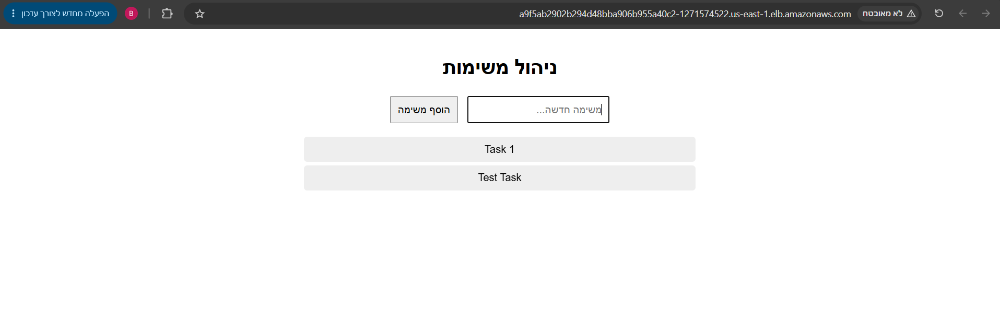
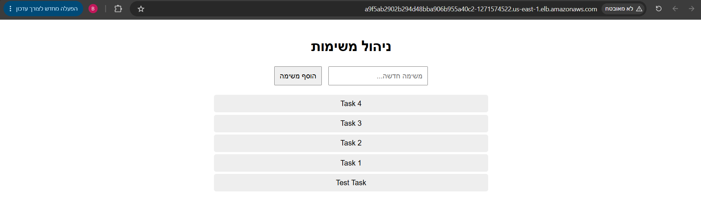
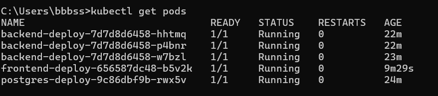
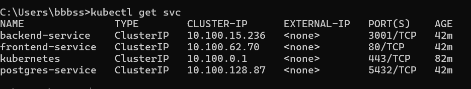
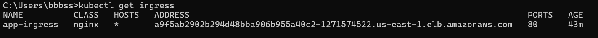

# Screenshots

## Application Running - Before Changes


## Application Running - After Changes (with API Proxy)


## Kubernetes Status

### kubectl get pods


### kubectl get svc


### kubectl get ingress


# DevOps Task Manager

A simple task management system with Frontend, Backend, and Database, deployed on Kubernetes.

⚠️ **SECURITY NOTICE**: Never commit real secrets to GitHub. This project uses AWS Secrets Manager to store sensitive data securely. See "Secrets Management" section below.

## Project Description

- **Frontend**: React application on port 3000
- **Backend**: Node.js Express API on port 3001
- **Database**: PostgreSQL 15
- **Orchestration**: Kubernetes (EKS)
- **Container Registry**: AWS ECR
- **CI/CD**: Jenkins

## Prerequisites

- AWS Account
- Docker
- kubectl
- AWS CLI
- Jenkins Server (Local or EC2)
- ngrok (if Jenkins runs locally)
- helm (for Ingress Controller)

## Setup Steps

### 1. Create ECR Repositories

```bash
# Configure AWS
aws configure

# Create repositories
aws ecr create-repository --repository-name devops-task-manager-backend --region us-east-1
aws ecr create-repository --repository-name devops-task-manager-frontend --region us-east-1

# Verify repositories were created
aws ecr describe-repositories --region us-east-1
```

### 2. Create EKS Cluster

```bash
# Create cluster with eksctl
eksctl create cluster --name task-manager-cluster --region us-east-1 --nodes 3 --node-type t3.medium

# Alternative: Use AWS Console (recommended for first-time setup with 3 nodes)

# Update kubeconfig after creation
aws eks update-kubeconfig --region us-east-1 --name task-manager-cluster

# Verify connection
kubectl get nodes
```

### 3. Install Nginx Ingress Controller

```bash
# Add Helm repository
helm repo add ingress-nginx https://kubernetes.github.io/ingress-nginx
helm repo update

# Install ingress-nginx
helm install nginx-ingress ingress-nginx/ingress-nginx \
  --namespace ingress-nginx \
  --create-namespace \
  --set controller.service.type=LoadBalancer
```

### 4. Local Testing with Minikube

```bash
# Start minikube
minikube start

# Apply manifest files
kubectl apply -f k8s/configmap.yaml
kubectl apply -f k8s/secret.yaml
kubectl apply -f k8s/postgress-pvc.yaml
kubectl apply -f k8s/postgres-db.yaml
kubectl apply -f k8s/backend-deploy.yaml
kubectl apply -f k8s/frontend-deploy.yaml
kubectl apply -f k8s/ingress.yaml

# Check deployments
kubectl get pods
kubectl get svc
kubectl get ingress

# Get minikube IP
minikube ip

# Access application in browser
# http://<minikube-ip>
```

### 5. Jenkins Setup

#### Option A: Local Jenkins with ngrok

```bash
# Install Jenkins (Mac/Linux)
brew install jenkins-lts

# Or download from https://www.jenkins.io/download/

# Start Jenkins
jenkins

# Access at http://localhost:8080

# Install ngrok
brew install ngrok

# Run ngrok
ngrok http 8080

# Copy the ngrok URL (e.g., https://abc123.ngrok.io)
```

#### Option B: Jenkins on EC2 (Recommended)

```bash
# Create EC2 instance (Ubuntu 20.04 LTS, t2.medium minimum)

# Connect to instance
ssh -i your-key.pem ubuntu@your-instance-ip

# Update packages
sudo apt update && sudo apt upgrade -y

# Install Java
sudo apt install openjdk-11-jdk -y

# Install Jenkins
wget -q -O - https://pkg.jenkins.io/debian-stable/jenkins.io.key | sudo apt-key add -
sudo sh -c 'echo deb https://pkg.jenkins.io/debian-stable binary/ > /etc/apt/sources.list.d/jenkins.list'
sudo apt update
sudo apt install jenkins -y

# Start Jenkins
sudo systemctl start jenkins
sudo systemctl enable jenkins

# Check status
sudo systemctl status jenkins

# Get initial admin password
sudo cat /var/lib/jenkins/secrets/initialAdminPassword

# Access Jenkins
# http://your-instance-ip:8080
```

### 6. Configure GitHub Webhook

1. In your GitHub repository, go to Settings → Webhooks
2. Click "Add webhook"
3. Payload URL: `https://your-jenkins-url/github-webhook/` (if using ngrok) or `http://your-ec2-ip:8080/github-webhook/`
4. Content type: `application/json`
5. Select events: `Push events`
6. Check "Active"
7. Click "Add webhook"

### 7. Create Jenkins Job

1. In Jenkins, click "New Item"
2. Enter job name: `devops-task-manager`
3. Select: "Pipeline"
4. Click OK
5. Under Pipeline section:
   - Definition: `Pipeline script from SCM`
   - SCM: `Git`
   - Repository URL: `https://github.com/your-username/devops-task-manager.git`
   - Branch: `*/main`
6. Under Build Triggers section:
   - Check: `GitHub hook trigger for GITScm polling`
7. Save

### 8. Configure AWS Credentials in Jenkins

1. In Jenkins, click "Manage Jenkins" → "Manage Credentials"
2. Click "(global)" → "Add Credentials"
3. Select "AWS Credentials"
4. Access Key ID: `your-aws-access-key`
5. Secret Access Key: `your-aws-secret-key`
6. ID: `aws-credentials`
7. Save

### 9. Update Jenkinsfile

Update the following values in the `Jenkinsfile`:
```groovy
environment {
    AWS_REGION = 'your-region'
    ECR_REGISTRY = 'your-account-id.dkr.ecr.your-region.amazonaws.com'
    EKS_CLUSTER_NAME = 'your-cluster-name'
}
```

## Verifying the Application

### Check Pods
```bash
kubectl get pods
```

Expected output:
```
NAME                              READY   STATUS    RESTARTS   AGE
backend-deploy-xxxxx-xxxxx        1/1     Running   0          2m
backend-deploy-xxxxx-xxxxx        1/1     Running   0          2m
backend-deploy-xxxxx-xxxxx        1/1     Running   0          2m
frontend-deploy-xxxxx-xxxxx       1/1     Running   0          2m
postgres-deploy-xxxxx-xxxxx       1/1     Running   0          2m
```

### Check Services
```bash
kubectl get svc
```

### Check Ingress
```bash
kubectl get ingress
```

### Check Deployments
```bash
kubectl get deployment
```

## Running the Pipeline

1. In GitHub, commit and push your changes
2. GitHub triggers webhook to Jenkins
3. Jenkins starts the Pipeline
4. Monitor pipeline progress in Jenkins dashboard

## Secrets Management

**NEVER commit real secrets to GitHub.** This project uses AWS Secrets Manager for secure secret storage.

### Setup AWS Secrets Manager

1. **Create a secret in AWS Secrets Manager:**
```bash
aws secretsmanager create-secret \
  --name app-secrets \
  --region us-east-1 \
  --secret-string '{"DB_USER":"postgres","DB_PASSWORD":"your-secure-password"}'
```

2. **Grant Jenkins IAM permissions** to access Secrets Manager:
   - Add policy: `SecretsManagerReadWrite` to Jenkins IAM role
   - Or create custom policy for specific secret access

3. **Grant EKS Pod permissions** (using IRSA - IAM Roles for Service Accounts):
```bash
# Create IAM role for service account
eksctl create iamserviceaccount \
  --name task-manager-sa \
  --namespace default \
  --cluster task-manager-cluster \
  --attach-policy-arn arn:aws:iam::aws:policy/SecretsManagerReadWrite \
  --region us-east-1
```

### Local Development

For local testing with Minikube, create `k8s/secret.yaml` locally (not in GitHub):

```bash
# Copy from example
cp k8s/secret.yaml.example k8s/secret.yaml

# Edit with your values and encode them
echo -n "postgres" | base64
echo -n "supersecretpassword" | base64
```

**Important**: `k8s/secret.yaml` is in `.gitignore` and will never be committed to GitHub.

### Why Not Base64?

Base64 is **encoding, not encryption**. It's trivial to decode:
```bash
echo "cG9zdGdyZXM=" | base64 -d  # Outputs: postgres
```

Always use:
- **AWS Secrets Manager** (recommended for EKS)
- **HashiCorp Vault** (for multi-cloud)
- **Sealed Secrets** or **External Secrets** (for Kubernetes-native solution)
- **Encrypted environment files** (for local development only)

## Troubleshooting

### View Pod Logs
```bash
kubectl logs <pod-name>
kubectl logs <pod-name> -f  # follow mode
```

### Check Deployment Status
```bash
kubectl describe deployment <deployment-name>
kubectl rollout status deployment/<deployment-name>
```

### Check Health Endpoint
```bash
kubectl port-forward svc/backend-service 3001:3001
curl http://localhost:3001/health
```

### Delete Resources
```bash
kubectl delete -f k8s/

# Or delete specific resources
kubectl delete pod <pod-name>
kubectl delete deployment <deployment-name>
```

## Data Storage

Database data is persisted in PersistentVolume. When a Pod is restarted, data is preserved.

```bash
kubectl get pvc
kubectl describe pvc postgres-pvc
```

## Rolling Updates

When pushing a new image, Kubernetes performs a rolling update:
- One new Pod starts
- One old Pod stops
- Process repeats until all Pods are updated

This enables Zero Downtime Updates.

## Architecture Notes

- Frontend communicates with Backend via Service name: `http://backend-service:3001`
- Database must be ready before Backend starts
- Health checks ensure only healthy Pods receive traffic
- PersistentVolume requires StorageClass (`gp2` on AWS)

## Requirements Fulfillment

- ✅ 3 Backend Pods
- ✅ 1 Frontend Pod
- ✅ 1 Database Pod
- ✅ Persistent Volume for Database
- ✅ No hardcoded secrets (base64 encoded, managed via Secrets Manager)
- ✅ Health Checks
- ✅ Ingress (Frontend only)
- ✅ Rolling Updates (Zero Downtime)
- ✅ Jenkins Pipeline
- ✅ GitHub Webhook
- ✅ Version Tagging

## Screenshots Required for Submission

1. **Application Running** - Screenshot of application accessible via Ingress in browser
2. **Jenkins Pipeline** - Screenshot of green/successful Pipeline in Jenkins
3. **kubectl outputs**:
   ```bash
   kubectl get pods
   kubectl get svc
   kubectl get ingress
   ```

---

For more information: [Kubernetes Documentation](https://kubernetes.io/docs/)


///push for testing pipeline!!
